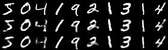

# Neural Net

This implements a basic feed-forward neural net using Numpy. The NeuralNet class has the following building blocks:

* Activation Functions: ReLU, Sigmoid
* Optimization algorithms: Gradient Descent (stochastic or batch, with or without momentum) and ADAM
* Regularization: L2-regularization
* Batch normalization
* Parameter initialization: He and Xavier
* Cost functions: binary cross-entropy, mean squared error

## Getting started

The project is coded in Python 3, using only Numpy for calculations and pickle for saving data.

### Prerequisites

Two packages are required for the NeuralNet package: numpy & pickle.
In addition, mnist_autoencoder.py uses TensorFlow/Keras as benchmark and to download MNIST data.

```
pip install numpy
pip install pickle
```

### Example

Once numpy, pickle and TensorFlow are installed with Python 3, you should be able to train the auto-encoder by running

```
python mnist_autoencoder.py
```

This trains the same auto-encoder model twice, first using NeuralNet, then using Keras/Tensorflow.

The image below shows a few input images (top row), NeuralNet auto-encoder output (middle row), and Keras output (bottom row).



## Authors

* **Anders Levander** - *Draft version* - [anleva/NeuralNet](https://github.com/anleva/NeuralNet)

## License

This project is licensed under the MIT License.

## Acknowledgments

* NeuralNet is based on Andrew Ng's excellent Deep Learning course on Coursera.com.
